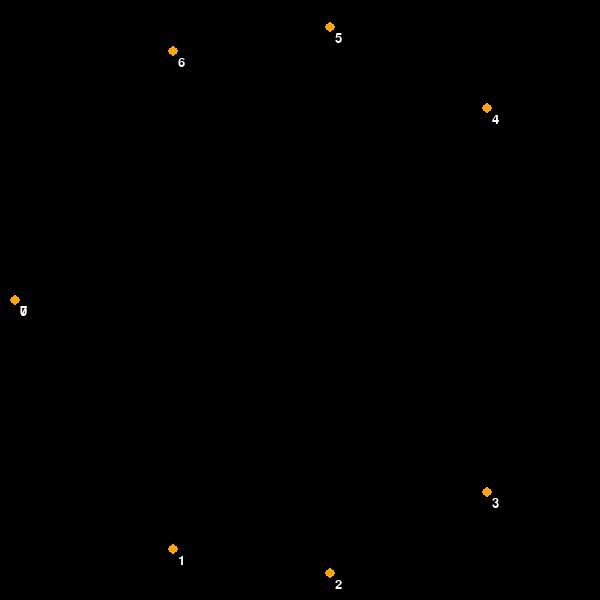

# Graph_MST program
This is a program that visualises a graph, and allows the user to either add nodes and edges with their weights themselves, or the program can create and adjacency matrix randomly.
THe program will then use Primm's Algorithm to find the minium spanning tree for this graph, or the way of visting all nodes from a starting node with the lowest total weight.
#

#Dependencies 
This uses the following python libaries

1. Pygame
2. Math
3. Random 
4. time

# Example

